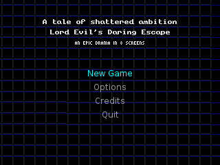
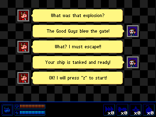
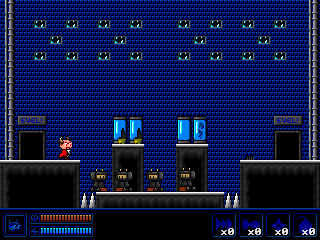

Lord Evil's Daring Escape
=========================

This game was originally conceived as an entry to Ludum Dare 25. It is
a retro platformer, featuring an evil mastermind in his quest to avoid
intergalactic justice.

Screenshots
-----------

Some screens from the current state of the game. All graphics are subject to change.

Dependencies
------------

 * [LÖVE 0.8](http://www.love2d.org)
 * [Frost framework](https://github.com/cryovat/frost)

For development aid:

 * [LDoc](https://github.com/stevedonovan/LDoc) by [stevedonovan](https://github.com/stevedonovan)
 * make, bash, iwatch, lua 5.1, sed and zip

Building/distribution
---------------------

The project uses GNU Make for setup/building/launching the game and
maintenance operations like rebuilding documentation.

To get started:

    git clone https://github.com/cryovat/lord-evil-game
    cd lord-evil-game
    make init

Make targets:

 * *all* - Default target. Calls init, clean and dist
 * *help* - Shows available targets
 * *init* - Initializes the development environment
 * *run* - Runs game in debug mode (updates submodules if needed)
 * *fastrun* - Runs game in debug mode without updating submodules
 * *clean* - Removes dist files and docs
 * *dist* - Creates distribution .love and .zip
 * *rundist* - Creates distribution and runs the generated file

Past versions
-------------

 * [Ludum Dare 25 version](https://github.com/cryovat/lord-evil-game/tree/ludum-dare-25)
